# SynROV — Multi-Robot Control, Simulation, AI and ROS Integration

SynROV is a multi-robot platform that brings **Manipulator**, **Vehicle**, and **Drone** control into one coordinated software stack. The project combines Arduino firmware, a Processing-based 3D operator station, a browser control console, the Python **AiBot** runtime, and optional ROS 2/rosbridge integration.

This repository is **SynROV software version 1**. Application envelopes carry `softwareVersion: 1`, while protocol names, schemas, variables, persistent paths, and ROS topics use stable names without embedded version suffixes.

<p align="center">
  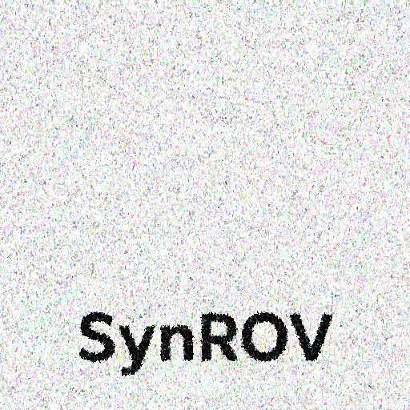
</p>

## Project goals

SynROV is designed to provide one consistent control and telemetry architecture across three physically different robots while keeping robot-specific behavior, safety logic, sensors, camera geometry, and autonomy policies separate.

Key capabilities include:

- one canonical application protocol for Web, AiBot, and ROS clients;
- Processing as the central dispatcher, state authority, and 3D operator interface;
- robot-specific control for Manipulator, tracked Vehicle, and Drone;
- hardware and local/simulation telemetry modes;
- collision-aware local control and environment mapping;
- dedicated 3D perception and robot-camera streaming channels;
- robot-specific AiBot orchestration, perception, missions, and voice input;
- ROS 2 interoperability through rosbridge without adding a second command contract;
- package-based Processing/AiBot/Web localization, with English as the default and Processing as the connected-system language authority;
- persistent configuration using the SynROV version-1 file layout.

## System architecture

```text
                         ┌──────────────────────┐
                         │      ROS 2 nodes     │
                         │   via rosbridge 9090 │
                         └──────────┬───────────┘
                                    │
                                    │ SynROV envelope in std_msgs/String
                                    │
┌──────────────────┐      ┌────────▼─────────┐      ┌────────────────────┐
│ Browser console  │◄────►│    Processing    │◄────►│   Python AiBot     │
│ SynROV.html      │ 9000 │ operator station │ 9000 │ Command Center / AI│
└──────────────────┘      │ central dispatcher│      └─────────┬──────────┘
                          └───────┬─────┬─────┘                │
                                  │     │                      │
                          9001 3D │     │ 9002 camera          │
                        perception│     │ stream               │
                                  │     └──────────────────────┘
                                  │
                          ┌───────▼────────┐
                          │ Arduino firmware│
                          │ serial / HEX    │
                          │ robot hardware  │
                          └─────────────────┘
```

HTML, AiBot, and ROS do not create independent robot-control contracts. They all send commands into Processing, which validates the canonical SynROV message envelope, resolves control ownership, selects the target robot, applies the shared safety path, and then forwards valid runtime commands to the robot hardware or local simulation.

## Visual overview

The Processing station is the central 3D operator interface and state authority. The same robot state is exposed to the browser console and AiBot through the canonical WebSocket contract. The screenshots below are from the version-1 interfaces included in this repository.

### Processing operator station

| Manipulator diagnostics | Vehicle mode | Drone mode |
|---|---|---|
| 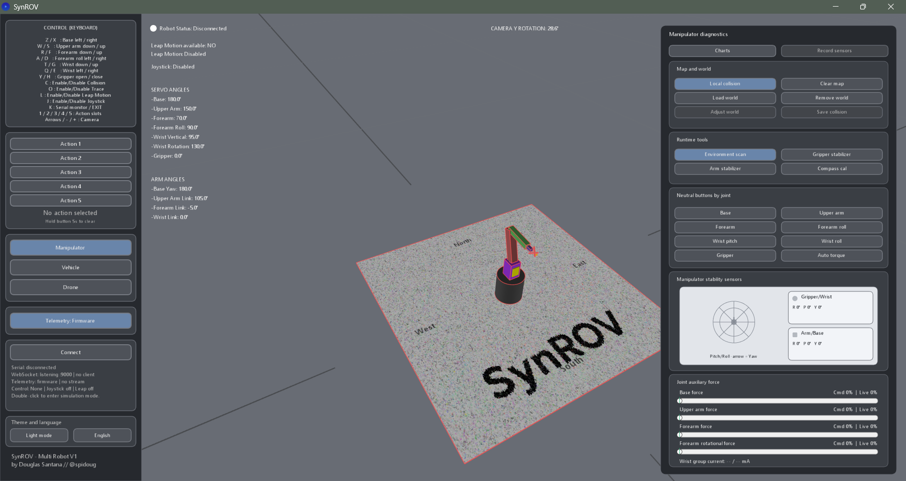 | 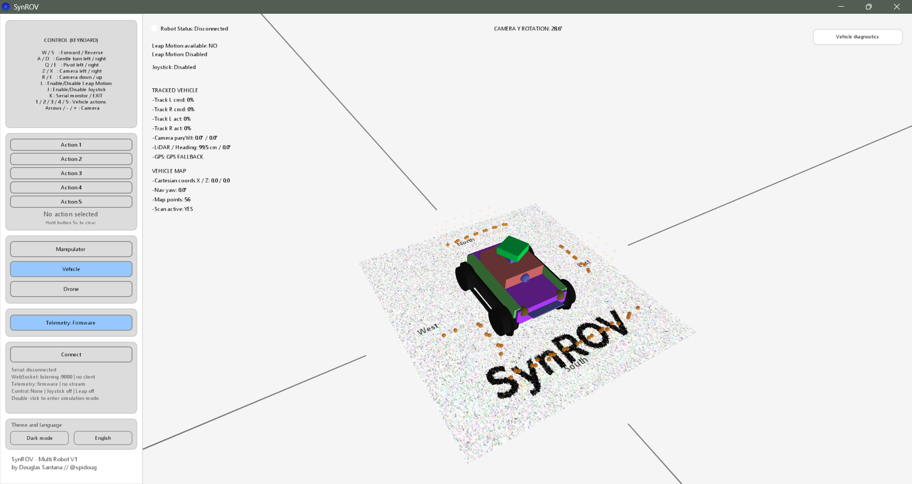 | 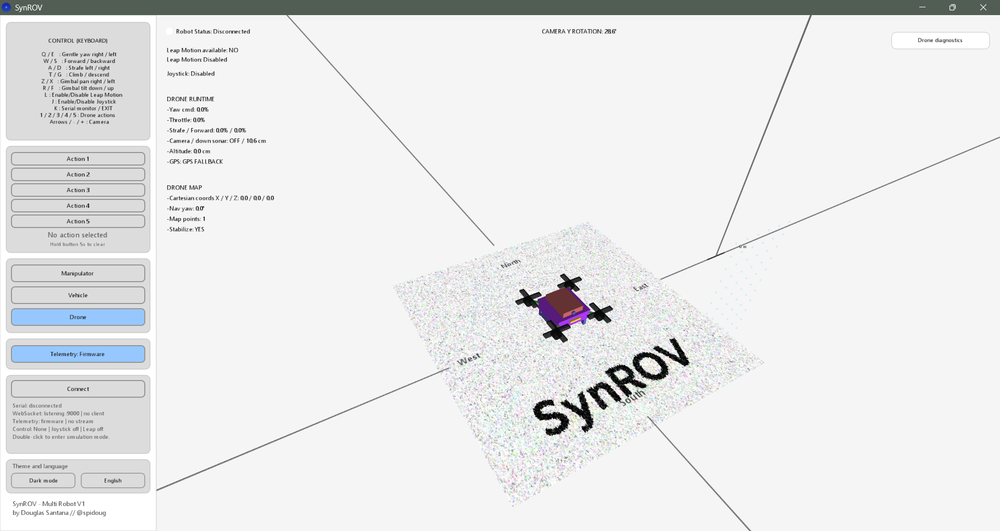 |

The operator station supports light/dark themes, robot-specific diagnostics, local simulation, map/world loading, collision data, and a Drone-centered 3D altitude reference.

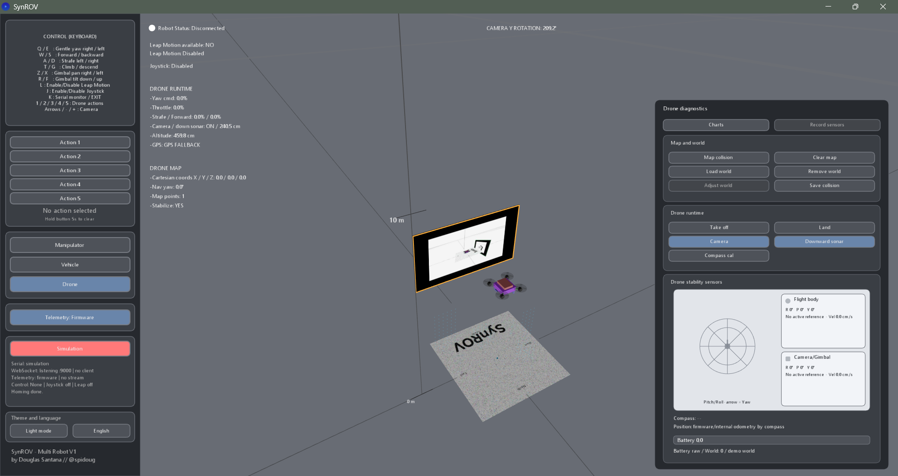

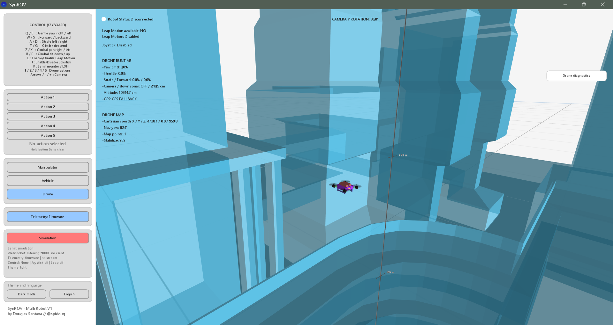

### Web, AiBot and joystick clients

| Browser console | AiBot Command Center |
|---|---|
| 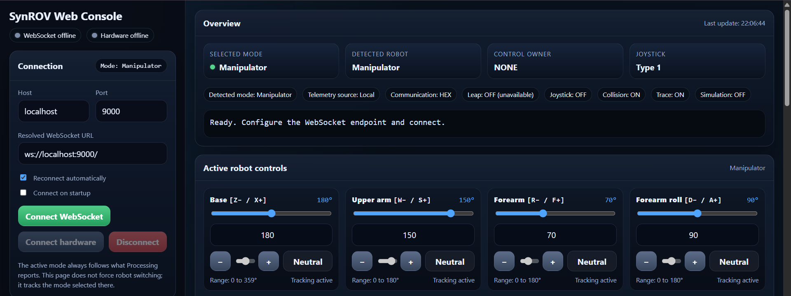 | 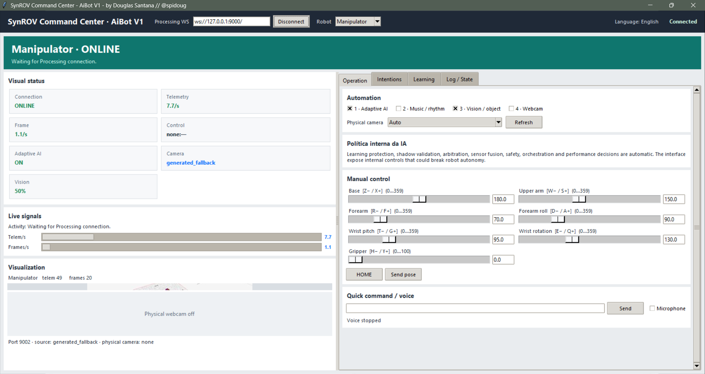 |


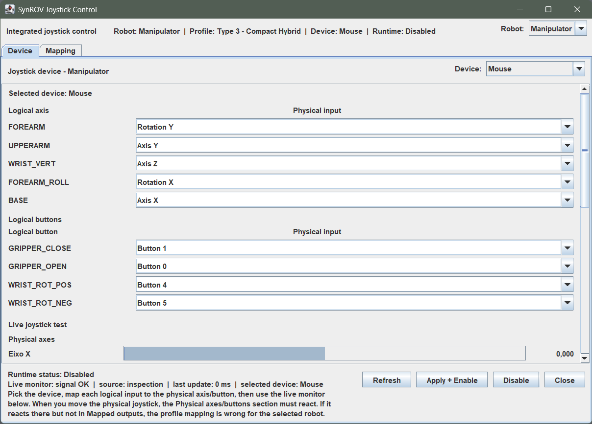

All three frontends use synchronized language packages. English is canonical/default; after connection, Processing publishes the active package code and both Web and AiBot follow it. Static and dynamic interface text is routed through the package system, with automated key-parity checks across all eight bundled languages.

## Canonical application protocol

Every application-level message uses the same envelope:

```json
{
  "protocol": "synrov",
  "softwareVersion": 1,
  "messageType": "control",
  "source": "web",
  "timestampMs": 1786392000000,
  "seq": 1,
  "payload": {}
}
```

The transport is independent from the application protocol:

| Port / endpoint | Purpose | Transport |
| --- | --- | --- |
| `9000` | Web/AiBot control and Processing state | WebSocket |
| `9001` | Processing 3D perception stream | WebSocket |
| `9002` | Vehicle/Drone robot-camera stream | WebSocket |
| `9090` | ROS integration | rosbridge WebSocket |
| `/synrov/control` | ROS command input | `std_msgs/msg/String` containing the SynROV envelope |

See [`docs/COMMUNICATION_PROTOCOL.md`](docs/COMMUNICATION_PROTOCOL.md) for the complete application contract and [`docs/ROS_INTEGRATION.md`](docs/ROS_INTEGRATION.md) for ROS behavior.

## Robot modes

### Manipulator

The Manipulator provides joint-level control, HOME/action playback, optional Leap Motion and joystick input, Auto Torque support, collision checking, base heading feedback, and workspace-oriented AiBot perception and missions.

The base feedback/display convention remains `0° = North`, increasing clockwise. Directional/relative controls are mapped to the physical actuator polarity, while absolute angular targets keep the canonical coordinate convention.

### Vehicle

The tracked Vehicle supports throttle/steering/pivot motion, front-camera pan/tilt, lights, LiDAR scanning, GPS/heading/IMU telemetry, collision-aware navigation, environment mapping, and robot-specific AiBot missions.

### Drone

The Drone supports takeoff/landing, altitude, yaw, forward/backward and lateral motion, front-camera pan/tilt, IMU/GPS/heading/altitude telemetry, obstacle/ground-clearance sensing, and aerial AiBot missions.

## 3D camera behavior

Vehicle and Drone use the same third-person camera-mode zoom reference. When the camera mode for the selected robot is enabled, Processing switches to a **rear chase view**, looking from behind the selected robot toward its forward direction. The previous operator camera rotation and zoom are restored when camera mode is disabled. In every Drone 3D orbit/zoom view, the Drone itself is the vertical scene reference: climb/descent moves the ground, grid, and imported world relative to the aircraft, keeping the Drone centered instead of allowing altitude changes to push it out of frame.

The physical camera image itself remains a separate stream on port `9002`. Processing places the camera monitor in 3D from the robot's actual camera origin and gimbal direction. Vehicle and Drone share the same mechanical gimbal safety envelope:

- pan: `-60° .. +60°`;
- tilt: `-20° .. +20°`.

See [`docs/ROBOT_CAMERA_STREAM.md`](docs/ROBOT_CAMERA_STREAM.md).

## Language packages

SynROV localization is package-based. English is the default package and Processing is the runtime language authority for the connected system.

The distribution includes **eight complete package sets** shared by Processing, AiBot, and the Web console: English (`en`), Portuguese/Brazil (`pt-br`), Spanish (`es`), French (`fr`), German (`de`), Simplified Chinese (`zh-cn`), Japanese (`ja`), and Arabic (`ar`).

- Processing discovers every valid `software/processing/SynROV/data/languages/*.json` package. English is always first/default; the language button displays the active native language name and cycles through all installed packages.
- The selected code is persisted by Processing and published as `state.language`; `state.languageAvailable` reports the discovered package codes.
- The standalone browser console always opens in **English**. After Processing synchronization it follows `state.language`, with English fallback when the requested package is unavailable. Arabic sets the Web document to RTL.
- AiBot loads `software/python/synrov_aibot/languages/*.json`, follows the Processing selection, translates its Command Center/catalog display, and uses the package `locale` for speech recognition.
- Additional languages can be installed without changing the protocol. The same normalized package `code` must be used in all three components.

See [`docs/LANGUAGE_PACKS.md`](docs/LANGUAGE_PACKS.md) for package schema, the bundled language matrix, and extension instructions.

## Repository structure

```text
firmware/SynROV_Firmware/
  SynROV_Firmware.ino                 Arduino firmware entry point
  FirmwareDeclarations.h              shared firmware declarations/configuration
  01_...09_*.h                        firmware modules

software/processing/SynROV/
  SynROV.pde                          Processing application entry point
  LanguagePacks.pde                   package discovery, selection and translation
  data/languages/                     Processing language packages
  CommunicationProtocol.pde           canonical application protocol/dispatcher
  Logic_RuntimeBridge.pde             hardware/runtime bridge
  Vehicle3D.pde                       Vehicle model and runtime
  Drone3D.pde                         Drone model and runtime
  Manipulator3D.pde                   Manipulator model
  SceneEnvironment3D.pde              shared 3D world, grid, camera and zoom logic
  RobotCameraStream.pde               Vehicle/Drone camera transport and 3D camera mode
  AiPerceptionStream.pde              dedicated 3D perception stream
  RosIntegration.pde                  ROS/rosbridge integration
  EnvironmentMapping.pde              imported world and collision mapping

software/web/
  SynROV.html                         standalone browser control console
  languages/en.js                    default English Web language package
  languages/pt-br.js                 Portuguese (Brazil) Web package
  languages/es.js                    Spanish Web package
  languages/fr.js                    French Web package
  languages/de.js                    German Web package
  languages/zh-cn.js                 Simplified Chinese Web package
  languages/ja.js                    Japanese Web package
  languages/ar.js                    Arabic Web package

software/python/
  synrov_aibot.py                     AiBot launcher
  synrov_aibot/                       runtime, UI, perception, safety and orchestration
  synrov_aibot/languages/             AiBot JSON language packages
  tests/                              protocol and language-package tests
  README.md                           AiBot-specific instructions

docs/
  COMMUNICATION_PROTOCOL.md           canonical application protocol
  LANGUAGE_PACKS.md                   localization package schema and workflow
  AIBOT_COMMANDS_AND_INTENTIONS.md    robot-specific AiBot command catalog
  AIBOT_ROBOT_ORCHESTRATION.md        robot intelligence architecture
  ROBOT_CAMERA_STREAM.md              camera transport and camera-mode behavior
  ROS_INTEGRATION.md                  ROS 2 / rosbridge integration
  SynROV_Operating_Guide.md           operating guide
  SynROV_Operating_Guide.docx         Word version of the operating guide
  PROJECT_REVIEW.md                   implementation/review notes
```

## Quick start

### 1. Firmware

Open and flash:

```text
firmware/SynROV_Firmware/SynROV_Firmware.ino
```

Use the board/toolchain required by the SynROV hardware and verify the configured serial port, actuator mapping, motor/ESC direction, servo centers, sensor orientation, and safety limits before powered motion.

### 2. Processing operator station

Open:

```text
software/processing/SynROV/SynROV.pde
```

Run the sketch with its required Processing libraries. Processing is the central state authority and should be started before Web/AiBot clients that need live state synchronization.

The Processing operator window is resizable. The diagnostics panel opens expanded by default; double-click its title to collapse it into a floating diagnostics button on the right, and click that button to restore the panel. The keyboard-reference card uses fitted typography so the preferred text size remains readable without allowing longer language packages to overflow the card.

### 3. Browser console

Open:

```text
software/web/SynROV.html
```

The page starts in English. Connect it to the Processing WebSocket endpoint, normally `ws://127.0.0.1:9000/`. After synchronization, the page follows the language and selected robot reported by Processing.

### 4. AiBot

```bash
cd software/python
python -m pip install -r requirements.txt
python synrov_aibot.py
```

Headless mode:

```bash
python -m synrov_aibot --headless --uri ws://127.0.0.1:9000/ --loop
```

With automatic local camera selection:

```bash
python -m synrov_aibot --headless --uri ws://127.0.0.1:9000/ --loop --camera auto
```

See [`software/python/README.md`](software/python/README.md) for AiBot details.

AiBot maintains one persistent bounded strategy policy per robot. Trainable search/inspection missions try only pre-approved strategy variants, score them from sensor/vision outcomes, store experience in `runtime_data`, and reuse better-performing variants across mission segments and later runs. This is not unrestricted motor exploration: direct commands and safety-critical actions remain deterministic and Processing/firmware safety stays authoritative.

### 5. ROS 2 / rosbridge

Start rosbridge on the configured URI, normally:

```text
ws://127.0.0.1:9090
```

ROS commands are accepted only through `/synrov/control` using the canonical SynROV JSON envelope inside `std_msgs/msg/String`. `/cmd_vel` and `/joint_targets` are intentionally not parallel command inputs.

## Configuration and persistence

SynROV version 1 uses these persistent paths:

- `data/synrov.json`;
- `data/joystick.json`;
- robot-specific Processing configuration files;
- `synrov_aibot/runtime_data/`.

These files are validated against `softwareVersion: 1` where applicable.

### Canonical controls and safe GPS HOME

Processing keyboard directions are the project-wide physical reference. Joystick, Leap Motion, WebSocket/HTML, and AiBot map into the same semantic signs. Vehicle and Drone share one camera-tilt convention: `R = down (-)` and `F = up (+)`, with positive tilt meaning camera up everywhere, including 3D visualization and camera projection. The version-1 joystick schema is `synrov.joystick`; inversion is available only as explicit analog-axis hardware calibration, while digital `POS/NEG` bindings keep their semantic sign. AiBot command names and Web directional controls expose the matching Processing key where practical. Vehicle steering and in-place pivot are separate commands, and Drone yaw uses positive = right/clockwise. See `docs/CONTROL_DIRECTION_AND_SAFE_HOME.md` for the complete direction table.

Each runtime connection owns one GPS HOME in RAM. The first fresh GPS fix after connection becomes the safe origin and remains unchanged through landing, stopping, and robot-mode changes. Vehicle never persists HOME. Drone persists the session HOME only when battery is strictly below 10%, as a one-write emergency EEPROM snapshot that may be restored after a critical-battery reboot. The normal RTH battery threshold remains separately configurable.

## Validation

The repository includes Python protocol tests under `software/python/tests/`. Useful checks include:

```bash
cd software/python
python -m compileall synrov_aibot
python -m unittest discover -s tests -v
```

The browser JavaScript can also be syntax-checked by extracting the script and using Node.js, while Processing and Arduino firmware should be compiled with their normal development toolchains before hardware deployment.

## Hardware pin maps

The following diagrams document the default Arduino Mega 2560 profiles used by SynROV. Their principal pin assignments were cross-checked against `FirmwareDeclarations.h` (tracks, ESCs, shared gimbal, LiDAR, lights/record/LED, sonar, I²C, Manipulator servo bank and base drive). Mode-dependent pin reuse is intentional; only the active robot profile should drive its corresponding outputs.

### Manipulator

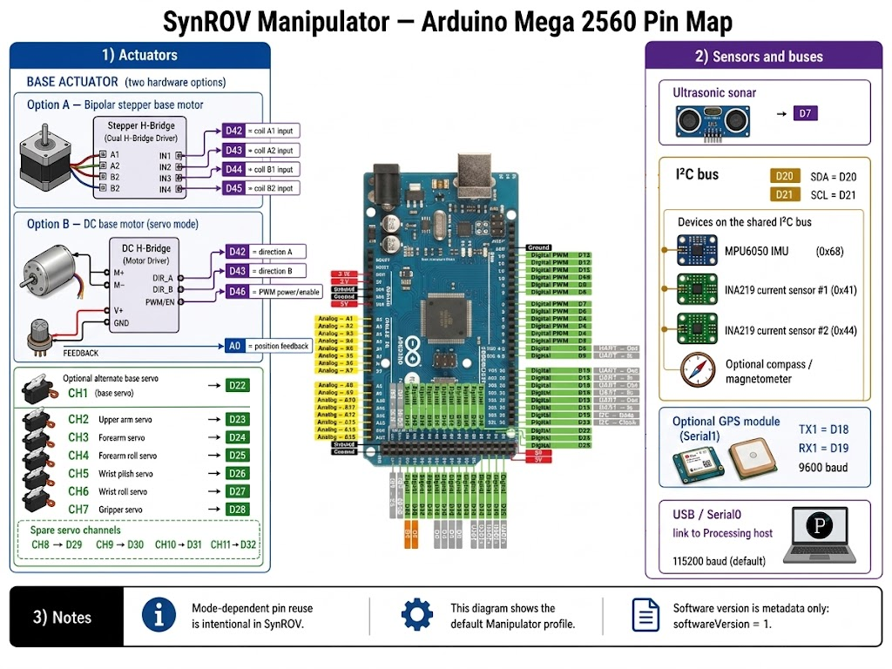

### Vehicle

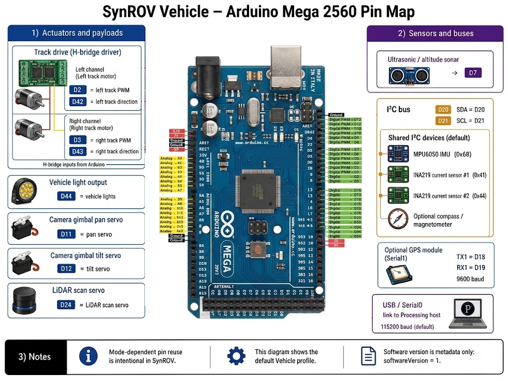

### Drone

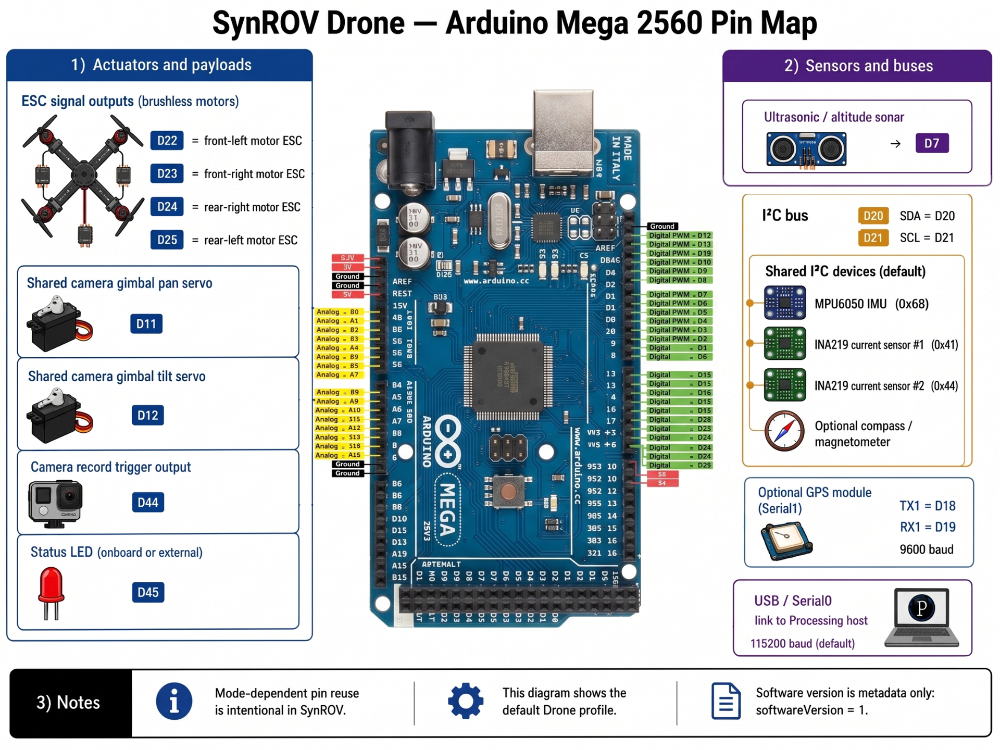

## Hardware safety

Before autonomous or unrestricted movement, validate the complete hardware chain at limited power:

- selected robot identity and configuration;
- motor/ESC direction and stop behavior;
- servo centers and mechanical limits;
- Vehicle/Drone camera neutral position and gimbal limits;
- IMU, magnetometer/heading, GPS, and altitude orientation/reference;
- obstacle sensors and collision behavior;
- battery and communication-link health;
- emergency stop / neutral behavior;
- firmware and Processing telemetry agreement.

Do not rely on simulation behavior alone as proof of safe hardware operation.

## Documentation

- [Communication protocol](docs/COMMUNICATION_PROTOCOL.md)
- [AiBot commands and intentions](docs/AIBOT_COMMANDS_AND_INTENTIONS.md)
- [AiBot robot orchestration](docs/AIBOT_ROBOT_ORCHESTRATION.md)
- [Robot camera stream](docs/ROBOT_CAMERA_STREAM.md)
- [ROS integration](docs/ROS_INTEGRATION.md)
- [Operating guide](docs/SynROV_Operating_Guide.md)
- [Project review](docs/PROJECT_REVIEW.md)

## License

See [`LICENSE`](LICENSE).
