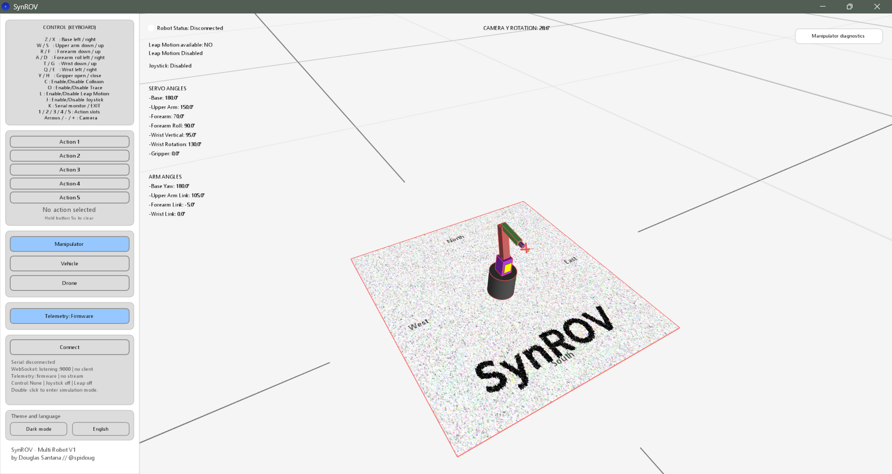

# SynROV — Operating Guide — software version 1

<p align="center">
  
</p>

SynROV coordinates the Manipulator, tracked Vehicle, and Drone through one Processing-centered runtime. This guide shows the normal operator workflow, the connected Web/AiBot clients, language behavior, safety prerequisites, and the default Arduino Mega 2560 pin maps.

## Start

1. Flash `firmware/SynROV_Firmware/SynROV_Firmware.ino`.
2. Start `software/processing/SynROV/SynROV.pde`.
3. In `software/python`, run `python synrov_aibot.py` when AiBot is required.
4. Select Manipulator, Vehicle or Drone and verify the detected hardware identity before motion.

The Processing window requests up to `1400 × 920`, then automatically fits and centers itself inside the monitor usable work area, reserving space for window decorations/taskbars so the title bar remains reachable on first launch.



## Processing operator interface

Processing is the central dispatcher, control-direction reference, 3D operator station, language authority, and local/simulation state authority. The diagnostics panel is robot-specific and can be collapsed to a compact restore button. Manipulator HOME always returns to the V1 initial pose `180,150,70,90,95,130,0`; Processing, AiBot and firmware use this same fixed seven-member pose. Starting HOME cancels pending Manipulator interpolation/playback so no competing target can overwrite the homing trajectory.


### Vehicle

Vehicle mode exposes track drive, steering/pivot behavior, camera pan/tilt, lights, LiDAR scan state, navigation telemetry, collision/map data, and robot-specific diagnostics.


### Drone

Drone motion follows the explicit flight phases `grounded → taking_off → airborne → landing`. Horizontal movement and yaw become available as soon as a takeoff or positive climb sequence is accepted; physical altitude remains the criterion for the `airborne` phase and takeoff completion. The held HTML descend control sends the canonical negative throttle without depending on browser `flightReady`; Processing alone enforces the landed-zone block. Once measurable lift exists, manual negative throttle can take authority from automatic takeoff and descend, and manual positive throttle can take authority from automatic landing and climb.


In simulation and world views, the Drone remains the vertical reference so altitude changes move the scene relative to the aircraft instead of pushing the Drone out of frame. The altitude reference is applied inside the same zoom transform as the grid and imported world, so zoom continues to follow the Drone while it climbs or descends.


Imported worlds, collision geometry, and map data share the same 3D runtime.


## Communication

HTML, AiBot and ROS use the same SynROV application envelope with Processing. The software release is carried only by `softwareVersion: 1`.

- `9000`: control/state WebSocket for HTML and AiBot;
- `9001`: Processing 3D perception stream, same envelope;
- `9002`: Vehicle/Drone camera stream, same envelope;
- `9090`: rosbridge endpoint when ROS integration is enabled.

ROS commands enter only through `/synrov/control` as `std_msgs/String` containing the canonical SynROV envelope. Web, AiBot and ROS keep separate control ownership while sharing the same dispatcher and safety path. Rosbridge registrations use full ROS 2 type names, stable operation IDs, and explicit `keep_last / reliable / volatile` QoS. The native `/synrov/joint_states` view publishes all Manipulator articulation positions in radians.

## Web console

The standalone Web console opens in English before synchronization, connects to Processing on port `9000`, and then follows `state.language`. Robot controls use the same semantic directions as the Processing keyboard and the same Drone flight prerequisites.


## AiBot

AiBot has one runtime and robot-specific intelligence for Manipulator, Vehicle and Drone. A Manipulator HOME command stops any active Manipulator mission before it sends the canonical HOME action, so autonomy cannot immediately overwrite the homing target. The desktop application remains the Tkinter SynROV Command Center. The **Operation** tab exposes adaptive AI, music/rhythm, vision/object tools and Webcam. Bounded mission-strategy learning, teachable spoken-phrase aliases, and long-context episodic memory are available independently to all three robots; only music/rhythm actuation remains exclusive to Manipulator. During trainable missions, the Log shows the strategy variant, reward and accumulated observations.

The AiBot UI uses canonical English keys for all static widgets and translates them through the selected package, keeping the complete interface in the selected language.


The AiBot interface uses the selected language package for its complete static UI.

## Joystick

The integrated joystick window maps physical axes/buttons to robot-specific logical controls and provides a live input monitor before the mapping is enabled. Vehicle and Drone use the same camera-tilt joystick polarity; the default V1 mapping uses the same operator-facing tilt response in both modes. Joystick, Leap Motion, Web and AiBot enter the same Processing control path.


## Camera

Vehicle and Drone gimbals are fixed to pan `-60..+60°` and tilt `-20..+20°`. Processing projects the image monitor from the actual camera origin and optical direction, with the stream plane positioned farther from the robot for clearer 3D viewing. AiBot discovers usable webcams and can keep port `9002` active with the Processing-generated image when no physical source is available. CAMERA is one state for each Vehicle/Drone: the HTML button, Processing diagnostics button, and AiBot command turn the yellow camera indicator, robot-camera channel, and rear chase camera mode on or off together. Vehicle and Drone use the same camera-mode zoom reference, and the operator camera state is restored when CAMERA is disabled.

## Language packages and microphone

Processing is the language authority after connection. English is the default and the language button cycles all installed packages. SynROV ships with English, Portuguese (Brazil), Spanish, French, German, Simplified Chinese, Japanese, and Arabic. The standalone HTML console opens in English; after synchronization, both Web and AiBot follow the package code selected in Processing. AiBot also adopts the package speech locale, and Arabic Web content switches to RTL. Microphone input uses `sounddevice` PCM capture at 16 kHz mono with ambient-noise calibration and local phrase segmentation before transcription.

All eight packages have exact key parity inside each frontend. Automated tests verify AiBot, Processing, and Web package completeness together with dynamic UI localization paths. English remains the canonical fallback when a package is unavailable.

## Canonical control direction

All control sources populate one canonical runtime coordinate system; the protocol never changes signs by producer. Manipulator vertical directions are `S/F/G = up` and `W/R/T = down` for upper arm, forearm, and wrist respectively. Vehicle and Drone camera buttons use `R = down (-)` and `F = up (+)`, while pan uses `Z/X = left/right`. The analog joystick camera-tilt mapping uses the same visual calibration for Vehicle and Drone. Web yaw/pivot mouse buttons and AiBot yaw phrases are translated from the operator's visual reference before transmission; this visual mapping does not alter the canonical protocol fields.

## Safe GPS HOME

The first valid, fresh GPS position after the runtime connection becomes the session HOME and remains in RAM for the complete connection session. Landing, stopping, or changing robot mode does not replace it. Vehicle keeps this HOME in RAM only. Drone normally keeps it in RAM as well; when Drone battery falls strictly below `10%`, the current session HOME is written once as an emergency persistent copy. A critical reboot may recover that emergency copy while battery remains below `10%`; a healthy new session uses its first valid GPS fix as the normal RAM HOME.

## Compass and sensors

Heading/compass is part of all three robot sensor contexts. Verify heading, magnetometer/IMU orientation, GPS where applicable, link quality, battery and obstacle sensors before autonomous missions.

## Manipulator base

The base feedback/display coordinate remains `0° = North` and increases clockwise. Directional base controls follow the physical actuator polarity while absolute targets keep the same coordinate convention.

Factory A0 calibration defaults are `ZEROADC=400` and `SPANRAW=765`. The base DC position loop defaults to `Kp=8.00`, `Ki=0.35`, `Kd=0.60`, `PIDSTOP=0.80°` and `PIDEXIT=1.60°`. PID actuator direction is configurable in firmware CFG mode and persisted by the current firmware format.

## Hardware pin maps

The diagrams below show the default Arduino Mega 2560 profiles. The principal assignments were cross-checked against `FirmwareDeclarations.h`: Manipulator base/servo bank, Vehicle tracks/lights/gimbal/LiDAR, Drone ESCs/gimbal/record/LED, shared sonar and I²C. Mode-dependent pin reuse is intentional; verify the active robot profile before energizing outputs.

### Manipulator


### Vehicle


### Drone


## Headless AiBot

```text
cd software/python
python -m synrov_aibot --headless --uri ws://127.0.0.1:9000/ --loop
```

## Persistence

SynROV version 1 uses `data/synrov.json`, `data/joystick.json`, robot config files and `synrov_aibot/runtime_data/`. Versioned metadata uses `softwareVersion: 1` where applicable.

## Safety check before autonomous motion

Verify robot identity, heading, IMU orientation, camera neutral/limits, battery, communication link and obstacle sensors. Test motors, ESCs, servos and gimbal at limited power before unrestricted motion. Simulation behavior alone is not proof of safe hardware behavior.
